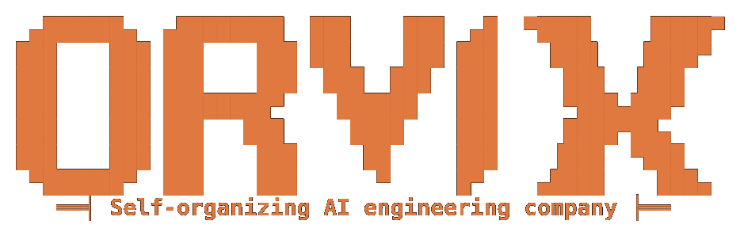
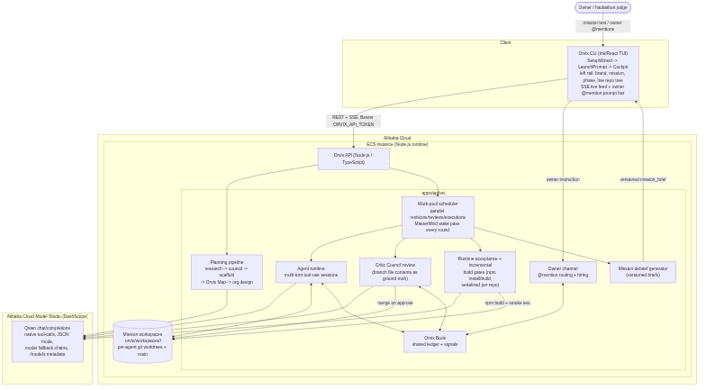

<div align="center">



**Orvix turns one product request into an on-demand AI engineering agency.**
It plans the project, creates the specialist agents it needs, lets them coordinate through a
shared ledger, runs their work in parallel branches, reviews their PR-style submissions, and
keeps expanding the team when the mission changes.

[](LICENSE)
[](https://qwencloud.com)
[](docs/architecture/)
[](docs/DEPLOYMENT.md)
[](docs/DEPLOYMENT.md)

**[Architecture PDF](docs/architecture/diagrams/orvix-architecture.pdf)** ·
**[Deployment Proof](docs/DEPLOYMENT.md)** ·
**[Full Documentation](docs/README.md)** ·
**[Alibaba Cloud Proof Recording](https://youtu.be/CaVT8MNpp8E)**

</div>

---

## Contents

- [What Orvix Is](#what-orvix-is)
- [Why This Exists](#why-this-exists)
- [What Orvix Builds](#what-orvix-builds)
- [Core System Concepts](#core-system-concepts)
- [Architecture](#architecture)
- [Mission Lifecycle](#mission-lifecycle)
- [Setup](#setup)
- [Alibaba Cloud Deployment](#alibaba-cloud-deployment)
- [Environment](#environment)
- [API Examples](#api-examples)
- [Repository Layout](#repository-layout)
- [Documentation Map](#documentation-map)
- [License](#license)

---

## What Orvix Is

Instead of a fixed chatbot or a static list of roles, Orvix behaves like a living software
organization:

> **MasterMind** directs the mission → **Strategy Weaver** designs the team → **specialists**
> build in parallel → **Critic Council** reviews → the **owner** can interrupt mid-flight to
> redirect or request new work.

```text
User mission
  -> MasterMind analysis
  -> Orvix Map (locked build contract)
  -> dynamic agent organization
  -> parallel implementation branches
  -> Orvix Book coordination
  -> Critic Council reviews
  -> runtime acceptance
  -> final delivery brief
```

The goal isn't to make one AI assistant pretend to be many roles. It's to build an agent
runtime that organizes itself around the work: decompose the mission, create agents on demand,
negotiate through a shared ledger, resolve conflicts, review code, and produce a working
output.

## Why This Exists

Most coding agents are single-threaded — they receive a request, produce code, and maybe
revise it. Orvix explores a different model: **software delivery as an autonomous agent
society**, built on four ideas:

| Idea | What it means |
| --- | --- |
| **Self-organization** | MasterMind and Strategy Weaver decide which agents the mission needs — nobody templates the roster in advance |
| **Self-expansion** | The [owner channel](docs/owner-channel/) lets MasterMind route follow-up work or hire a brand-new specialist mid-mission |
| **Parallel execution** | Independent agents work at the same time through a dependency-aware scheduler, not in turns |
| **Shared organizational memory** | Agents coordinate through the [Orvix Book](docs/orvix-book/) instead of one giant shared prompt |

The user asks for an outcome; Orvix forms the temporary engineering company needed to deliver
it.

## What Orvix Builds

Orvix takes high-level software missions, in plain English:

```text
Build a SaaS CRM with auth, dashboard, contacts and notes.
Build a small playable 2D web game in React.
Build a weather dashboard with search, favorites and error states.
```

For each mission, Orvix creates a dedicated workspace under `.orvix/workspaces/<missionId>/`,
scaffolds a project, runs agents against real files, opens internal PR-style work items,
reviews them, merges approved branches, and runs build/acceptance checks before finalizing the
mission.

---

## Core System Concepts

### MasterMind Agent

[MasterMind](docs/architecture/) is the mission director. It reads the user request, watches
the mission, resolves conflicts, routes owner instructions, and decides when the project is
ready for release — not a fixed script, but one driven by live mission state,
[Orvix Book](docs/orvix-book/) context, PR/task status, runtime failures, owner requests, and
Qwen reasoning output.

### Orvix Map

The **[Orvix Map](docs/orvix-map/)** is the locked build contract for the mission. It defines:

<table><tr><td valign="top" width="50%">

- product scope
- pages, screens, routes, endpoints, or CLI commands
- components and interaction contracts
- data and system contracts

</td><td valign="top" width="50%">

- design direction
- agent work packets
- file ownership hints
- acceptance gates and forbidden outputs

</td></tr></table>

Every agent, reviewer, and acceptance gate reads from the same map — nobody invents an
incompatible version of the product.

### Orvix Book

The **[Orvix Book](docs/orvix-book/)** is the shared coordination ledger. Agents post
questions, answers, assumptions, contracts, handoffs, conflicts, review notes, and owner
instructions to it — and each agent receives only a *filtered slice* of the Book when it starts
a session. This is effectively Orvix's agentic loop: agents continuously influence each other
through structured messages, not just the original user prompt.

### Strategy Weaver

[Strategy Weaver](docs/planning/) designs the agent society for the mission — a small team for
a small project, a larger organization for a complex product. Agents are encouraged to own
vertical slices where possible: a complete capability or surface end-to-end, rather than
artificial frontend/backend/style fragments that create unnecessary dependency chains.

### Critic Council

[Critic Council](docs/collaboration/) reviews PR-style work against the
[Orvix Map](docs/orvix-map/) — seeing the diff *and* the current branch file contents, so it's
never fooled by a small diff or already-merged work. It can approve, request changes, reject
markdown-only implementation work, flag missing source evidence, and route concrete revision
requirements back to the responsible agent.

### Owner Channel

The human owner can steer a running mission from the cockpit through the
**[owner channel](docs/owner-channel/)**:

```text
make the UI more premium and dark
@frontend-manager switch the dashboard to black and white
@critic-council review the auth flow more strictly
```

Owner messages enter the [Orvix Book](docs/orvix-book/) as first-class entries from `owner`.
MasterMind is always aware of them. Direct `@agent-id` mentions route to that agent and can
reopen work; unaddressed instructions go through MasterMind triage. If no current agent fits
the request, MasterMind creates a new specialist for it.

---

## Architecture



Orvix has two runtimes:

| Runtime | Role |
| --- | --- |
| `apps/api` | The actual Orvix runtime: planning, scheduling, Qwen calls, Orvix Map, Orvix Book, git workspaces, reviews, acceptance checks |
| `apps/cli` | The cockpit: SetupWizard, mission launcher, planning console, execution cockpit, activity tabs, owner prompt bar |

The CLI never calls Qwen directly and never mutates git — it talks to the API only over REST
and Server-Sent Events, which is what makes the cloud split meaningful:

```text
Local CLI       = cockpit
Alibaba Cloud   = agent society runtime (the API)
Qwen Cloud      = model reasoning and tool-call generation
```

📖 Full module map, design principles, and the mission-lifecycle sequence diagram:
[`docs/architecture/`](docs/architecture/) — also available as a
[4-page PDF](docs/architecture/diagrams/orvix-architecture.pdf).

## Mission Lifecycle

<table>
<tr><td width="36" align="center"><b>1</b></td><td>

**Planning** — a streamed pipeline: research → planning council → scaffold choice → MasterMind
analysis → Orvix Map draft/review/lock → Strategy Weaver organization design → Critic Council
rubric. The CLI shows every stage live. → [`docs/planning/`](docs/planning/)

</td></tr>
<tr><td align="center"><b>2</b></td><td>

**Execution** — a continuous work pool, not fixed waves: revisions, signal handling, PR
reviews, agent executions, and build gates all run concurrently. Agents run multi-turn Qwen
sessions with real tools (`read_file`, `write_file`, `commit_changes`, `open_pr`,
`post_book_entry`, `research_web`, …) — the model emits tool calls, Orvix executes them against
the workspace, and results feed back into the next turn.

</td></tr>
<tr><td align="center"><b>3</b></td><td>

**Collaboration** — dependency notes, file-ownership checks, merge-conflict routing, reviewer
revision loops, and a MasterMind wake-up pass that rescues blocked work *every scheduling
round*, not only when the whole pool goes idle. → [`docs/collaboration/`](docs/collaboration/)

</td></tr>
<tr><td align="center"><b>4</b></td><td>

**Review** — every PR-style work item is validated by Critic Council against the Orvix Map and
the branch's real file contents.

</td></tr>
<tr><td align="center"><b>5</b></td><td>

**Runtime acceptance** — once required PRs are approved, Orvix builds the generated project for
real and checks whether the shipped output actually satisfies the mission.

</td></tr>
<tr><td align="center"><b>6</b></td><td>

**Debrief** — MasterMind writes a versioned mission brief: what was built, how to run it, key
files, owner to-dos, and next steps.

</td></tr>
</table>

<details>
<summary><b>Where generated projects live on disk</b></summary>

<br>

```text
.orvix/
  workspaces/
    <missionId>/
      repo/                 generated project repository
        .git/               mission git repo
        <project files>     app/site/API/game created by agents
  runs/
    <missionId>/            mission state, events, Book, signals, turns
```

| Runtime choice | Where these folders live |
| --- | --- |
| **Local runtime** | Your machine, inside the Orvix repo you started the API from |
| **Alibaba Cloud runtime** | The ECS server — the API running there owns the agent tools, git workspace, build checks, and generated files. Your local CLI is only the cockpit. |

Mission snapshots live separately under `.orvix/runs/<missionId>/`, so a restarted API can
resume a mission from disk.

</details>

---

## Setup

**Prerequisites:** Node.js 20+, npm, git, and an Alibaba Cloud Model Studio / DashScope API key
(Qwen Cloud) for live Qwen mode.

```bash
git clone https://github.com/abbasmir12/orvix.git orvix
cd orvix
cp .env.example .env        # set DASHSCOPE_API_KEY
npm install
npm run build
npm run start:api           # terminal 1
npm run dev                 # terminal 2 — launches the cockpit
```

The SetupWizard offers:

| Mode | Purpose |
| --- | --- |
| Demo cockpit | Scripted local replay, no Qwen calls |
| Local runtime | CLI connects to `http://localhost:8787` |
| Alibaba Cloud runtime | CLI connects to a deployed Orvix API |

📖 Full setup guide: [`docs/SETUP.md`](docs/SETUP.md)

## Alibaba Cloud Deployment

To run Orvix as a remote agent runtime, deploy the **Orvix API** to an Alibaba Cloud ECS
instance and point the CLI at it from anywhere:

```bash
# on the ECS instance
git clone https://github.com/abbasmir12/orvix.git orvix && cd orvix
cp .env.example .env        # set DASHSCOPE_API_KEY, QWEN_BASE_URL, ORVIX_API_TOKEN
npm install && npm run build && npm run start:api
```

```bash
curl http://<ecs-public-ip>:8787/health
```

```json
{ "service": "orvix-api", "status": "ok", "provider": "Alibaba Cloud ready", "qwen": "configured" }
```

From your laptop, run the CLI, choose **Alibaba Cloud runtime**, and paste the API URL + the
same `ORVIX_API_TOKEN`:

```text
your laptop     = the cockpit
Alibaba Cloud   = the Orvix runtime
Qwen Cloud      = model reasoning
```

📖 Full walkthrough (ECS provisioning, security groups, TLS): [`docs/SETUP.md` §6](docs/SETUP.md#6-deploy-the-api-to-alibaba-cloud-ecs) ·
📄 Submission proof, with direct code-file links: [`docs/DEPLOYMENT.md`](docs/DEPLOYMENT.md)

## Environment

Minimum live configuration:

```bash
DASHSCOPE_API_KEY=...
QWEN_BASE_URL=https://dashscope-intl.aliyuncs.com/compatible-mode/v1
QWEN_MODEL=qwen-plus
ORVIX_API_TOKEN=<long-random-secret>   # required once the API is public
```

The CLI authenticates with `Authorization: Bearer <ORVIX_API_TOKEN>`.
📖 Full reference (every variable, every default): [`docs/env-reference/`](docs/env-reference/)

## API Examples

```bash
# Create a live Qwen-backed mission
curl -X POST http://localhost:8787/missions \
  -H "Content-Type: application/json" \
  -d '{"mission":"Build a SaaS CRM with auth, dashboard, contacts and notes","mode":"qwen"}'

# Inspect state
curl http://localhost:8787/missions/<mission_id>
curl http://localhost:8787/missions/<mission_id>/metrics
curl http://localhost:8787/missions/<mission_id>/book

# Post an owner instruction mid-mission
curl -X POST http://localhost:8787/missions/<mission_id>/owner \
  -H "Content-Type: application/json" \
  -d '{"message":"make the dashboard darker and more premium"}'
```

---

## Repository Layout

```text
apps/
  api/              Orvix runtime API
  cli/              Ink/React terminal cockpit

packages/
  core/             shared types, simulation state, run store
  qwen/             Qwen Cloud (DashScope) client, prompts, tool schemas
  workspace/        git workspace, worktrees, file tools, scaffold helpers

docs/
  architecture/     system architecture, diagrams, submission PDF
  orvix-map/        locked mission blueprint
  orvix-book/       shared agent ledger
  planning/         planning pipeline
  collaboration/    negotiation and conflict handling
  owner-channel/    human-in-the-loop steering
  cli/              CLI cockpit guide
  env-reference/    environment variables
  SETUP.md          local and Alibaba Cloud setup
  DEPLOYMENT.md     submission-facing Alibaba Cloud / Qwen Cloud proof
```

## Documentation Map

| Topic | Link |
| --- | --- |
| Architecture | [`docs/architecture/`](docs/architecture/) |
| Deployment proof | [`docs/DEPLOYMENT.md`](docs/DEPLOYMENT.md) |
| Setup | [`docs/SETUP.md`](docs/SETUP.md) |
| CLI | [`docs/cli/`](docs/cli/) |
| Orvix Map | [`docs/orvix-map/`](docs/orvix-map/) |
| Orvix Book | [`docs/orvix-book/`](docs/orvix-book/) |
| Planning | [`docs/planning/`](docs/planning/) |
| Collaboration | [`docs/collaboration/`](docs/collaboration/) |
| Owner Channel | [`docs/owner-channel/`](docs/owner-channel/) |
| Environment | [`docs/env-reference/`](docs/env-reference/) |

## License

[MIT](LICENSE)
