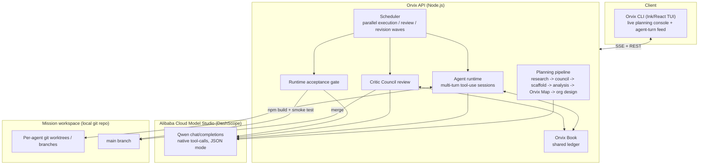

# Orvix

**Orvix is a self-organizing AI engineering company.** Give it a mission — "build a SaaS CRM," "build a browser snake game" — and it plans the work, designs its own team of specialist agents, runs them in parallel on real git branches, reviews their pull requests, and gates the result behind a runtime acceptance check before calling the mission done. No human writes a task list; Orvix does.

Built for the **Global AI Hackathon with Qwen Cloud — Track 3: Agent Society**, running entirely on Alibaba Cloud Model Studio (DashScope) via Qwen.

## Why Orvix

Most "multi-agent" demos are a single model wearing different hats in one call-and-response loop. Orvix is closer to a real engineering org:

- **MasterMind** plans the mission and locks a shared build contract (the **Orvix Map**) before anyone writes code.
- **Strategy Weaver** designs a bespoke org chart for *this* mission — up to 20 named specialists, not a fixed template.
- Each agent works **independently on its own git worktree branch**, in a real multi-turn tool-use session — it can `read_file`, `list_files`, `get_diff`, react to what it finds, and iterate, not just emit one shot of code blind.
- Agents coordinate through the **Orvix Book**, a shared ledger of questions, assumptions, contracts, and decisions — instead of a single flat context window.
- **Critic Council** reviews every PR against the Orvix Map and either merges or sends it back with concrete requested changes.
- A **Runtime Acceptance Gate** actually builds the project, smoke-tests the pages the map declared, and asks a Qwen judge whether the shipped product matches the mission — before the mission is allowed to complete.

Nothing here is a hidden deterministic fallback dressed up as AI output. When a Qwen call fails, Orvix says so (a `degraded` planning stage, an open Orvix Book question, a failed runtime judge) — it does not synthesize fake success.

## Architecture



See [`docs/ARCHITECTURE.md`](docs/ARCHITECTURE.md) for the module map and the full agent-lifecycle sequence diagram.

## How a mission runs

1. **Planning** (background, streamed live over SSE): research → planning council → scaffold choice → MasterMind mission analysis → Orvix Map draft + review + lock → Strategy Weaver org design → Critic Council review rubric.
2. **Execution**: the scheduler runs parallel waves of agent sessions. Each agent gets a system prompt built from its Orvix Map work packet, the Orvix Book context, and its allowed tools, then holds a real multi-turn conversation with Qwen — reading files, writing code, committing, and opening a PR.
3. **Review**: Critic Council inspects each PR's diff against the Orvix Map and either merges it or requests changes with specific comments; a deterministic gate also rejects markdown-only or scaffold-incoherent PRs before Qwen even sees them.
4. **Incremental build gate**: after each merge wave, Orvix runs `npm install`/`npm run build` on `main` and immediately routes any break back to the merging agent — integration failures are caught mid-run, not just at the end.
5. **Runtime acceptance**: once all required PRs are approved, Orvix builds the project for real, smoke-tests the routes the Orvix Map declared, and asks a Qwen judge whether the shipped product satisfies the mission's acceptance gates.
6. **Orvix Book**: throughout, agents ask each other questions and publish contracts/assumptions/decisions in a shared ledger instead of coordinating through one shared context window.

## Quickstart

```bash
npm install
cp .env.example .env   # set DASHSCOPE_API_KEY
npm run build
```

Start the API:

```bash
npm run start:api
```

Run the CLI against it:

```bash
node apps/cli/dist/index.js mission "Build a 2D snake game in the browser with score and game over" \
  --mode cloud --api-url http://localhost:8787
```

Or drive the API directly:

```bash
curl -X POST http://localhost:8787/missions \
  -H "Content-Type: application/json" \
  -d '{"mission":"Build a SaaS CRM with auth, dashboard, contacts and notes","mode":"qwen"}'

curl http://localhost:8787/missions/<mission_id>          # full state + planning stages
curl http://localhost:8787/missions/<mission_id>/metrics  # live Qwen usage + progress
curl http://localhost:8787/missions/<mission_id>/book     # Orvix Book ledger
```

`POST /missions` returns in well under a second — planning runs in the background and streams `planning` stage events (`started`/`completed`/`degraded`/`failed` per stage) over the SSE event stream, so nothing blocks and nothing hides a failure.

### CLI cockpit keys (cloud mode)

- `a` autopilot the scheduler · `x` execute next unblocked task · `r` run selected agent · `v` review next PR
- `1`–`6` switch activity tabs — `1` is the **live agent-turn feed** (default), then signals, PRs, decisions, reasoning, Orvix Book
- `Tab` switch panels · `↑`/`↓` scroll or select · `Enter` inspect an agent · `m` menu · `q` quit

## Modes

| Mode | What it does |
| --- | --- |
| `qwen` | Full Agent Society: Strategy Weaver designs a multi-agent org, agents work in parallel, coordinate via Orvix Book. |
| `solo` | Single-agent baseline: one generalist agent gets the entire mission alone, sequentially, with no team and no Orvix Book negotiation. Used to measure the society's actual gain. |
| `mock` | No API key required; deterministic local demo of the UI/flow without live Qwen calls. |

## Benchmark: society vs. solo baseline

Track 3 asks for a measurable efficiency gain over a single-agent baseline. `scripts/benchmark.mjs` runs the identical mission in `solo` and `qwen` mode against a live API, waits for both to finish, and writes a comparison report:

```bash
npm run start:api &
npm run benchmark -- "Build a 2D snake game in the browser with score and game over"
```

This writes `.orvix/benchmarks/benchmark-report.md` comparing wall-clock time, files written, PRs approved, Qwen calls, and tokens between the two modes. Sample run (mission: a single static HTML page):

| Metric | Solo (1 agent) | Orvix Society |
| --- | --- | --- |
| Completed | yes | yes |
| Wall-clock time | 544s | 785s |
| Agents | 2 | 4 |
| Tasks completed | 1/1 | 3/3 |
| PRs approved | 1/1 | 3/3 |
| Files written | 1 | 3 |
| Qwen calls | 14 | 46 |
| Total tokens | 152,833 | 731,330 |

On a mission this small, Strategy Weaver split trivial work into 3 specialist tasks and the coordination/review overhead outweighed the parallelism gain (society was ~1.4x slower here, though its output was more polished — CSS custom properties, focus states, hover states). This is the honest result, not a cherry-picked one: Agent Society earns its keep on missions with real independent surface area (e.g. a CRM with auth + dashboard + contacts + notes), where specialists can genuinely parallelize instead of subdividing one page. Re-run the benchmark on a larger, multi-surface mission for a submission number that reflects that case.

## Qwen Cloud configuration

```bash
DASHSCOPE_API_KEY=sk-...
QWEN_BASE_URL=https://dashscope-intl.aliyuncs.com/compatible-mode/v1
QWEN_MODEL=qwen-plus
```

`packages/qwen` talks to Alibaba Cloud Model Studio's OpenAI-compatible `/chat/completions` endpoint with native `tool_calls`, JSON response mode, per-role model overrides (`QWEN_PLANNER_MODEL` / `QWEN_AGENT_MODEL` / `QWEN_REVIEW_MODEL`), a global concurrency semaphore, and exponential-backoff retry on 429/5xx. See `.env.example` for every tunable (timeouts, concurrency, agent turn/tool-call budgets, solo-mode budgets).

**Model fallback chains.** `QWEN_MODEL` (and each per-role override) accepts either a single model or a comma-separated chain, e.g. `QWEN_MODEL=qwen3.7-max,qwen3.7-plus,qwen3.6-max`. Each model has its own free-tier quota pool; when the active model's quota is exhausted mid-run, the client detects the `AllocationQuota` error and seamlessly switches to the next model in the chain for all subsequent calls — no dropped mission, no manual restart. A single value with no comma behaves exactly as before.

## Alibaba Cloud deployment

```bash
docker build -f apps/api/Dockerfile -t orvix-api .
docker run -p 8787:8787 --env-file .env orvix-api
```

Deployment proof checklist for the submission video:

- ECS instance (or equivalent container runtime) on Alibaba Cloud running the `orvix-api` image
- Public `/health` returning `provider: "Alibaba Cloud ready"` and `qwen: "configured"`
- CLI connected with `--mode cloud --api-url <public-api-url>` running a live mission end to end

## Project structure

```text
apps/api/src/
  envConfig.ts     env + path config
  run.ts           MissionRun registry, SSE broadcast, metrics
  planning.ts       research -> council -> scaffold -> Orvix Map -> org design pipeline
  agentRuntime.ts   multi-turn agent tool-use sessions
  review.ts         Critic Council PR review + merge
  acceptance.ts     runtime build/smoke/Qwen-judge acceptance gate
  scheduler.ts      parallel execution/review/revision waves, autopilot
  book.ts           Orvix Book shared ledger
  research.ts       web search / URL fetch tools for planning
  server.ts         HTTP routes + SSE
apps/cli/src/
  App.tsx           SSE client, live state
  components/       PlanningConsole, MissionCockpit, and the rest of the Ink UI
packages/core/src/  simulation state, orchestrator, shared types
packages/qwen/src/  DashScope client, prompts, retry/concurrency/usage tracking
packages/workspace/src/  sandboxed git workspace + worktree tools
scripts/benchmark.mjs    solo vs. society benchmark runner
```

## License

[MIT](LICENSE)
