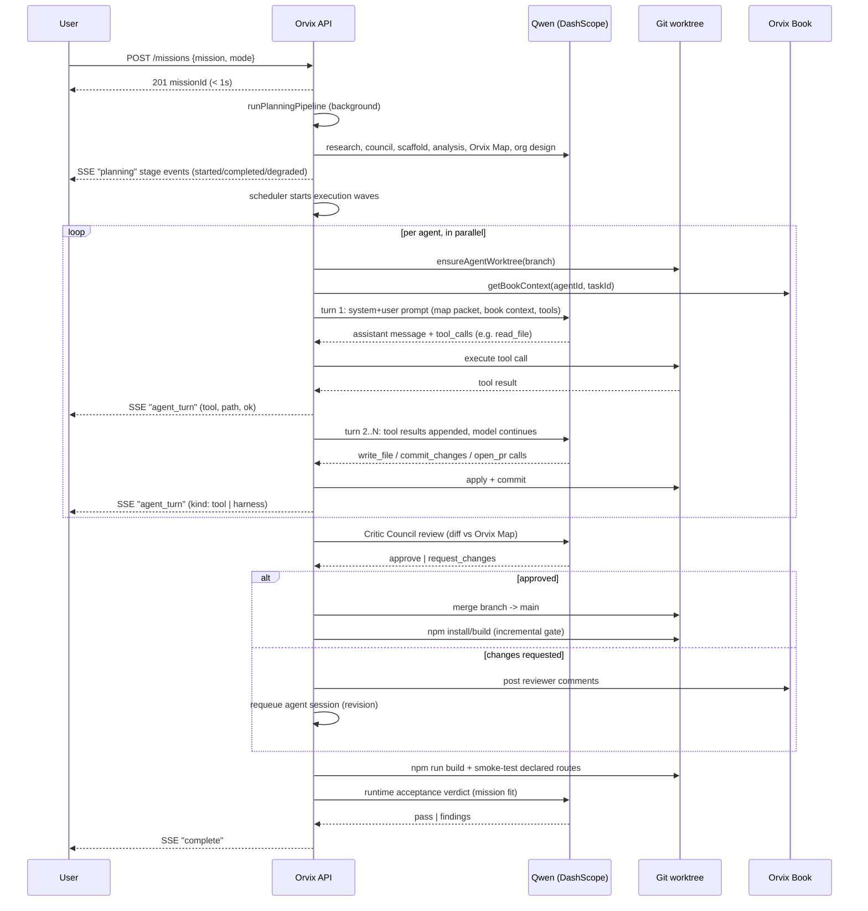

# Orvix Architecture

## Module map

```
apps/api/src/
  envConfig.ts    env loading, project/workspace root resolution, envPositiveInt helper
  run.ts          MissionRun registry (in-memory Map), SSE broadcast/subscribe, run store I/O,
                  planning-stage recording, per-run metrics (RunMetrics, metricsSummary,
                  withQwenUsageRun attribution listener)
  book.ts         Orvix Book: post entries, filtered per-agent context, signal routing
  research.ts     research_web / fetch_url tool implementations used during planning
  planning.ts     createRun -> runPlanningPipeline -> bootstrapQwenReasoning:
                  research -> council -> scaffold -> mission analysis -> Orvix Map -> org
                  design (or solo baseline) -> review rubric
  agentRuntime.ts executeAgentTask -> runAgentSession: the multi-turn tool-use loop, tool
                  execution against git worktrees, harness auto-commit/auto-PR safety net
  review.ts       reviewPullRequest: deterministic gates + Qwen Critic Council review + merge
  acceptance.ts   runRuntimeAcceptanceGate (build + smoke test + Qwen judge),
                  runIncrementalBuildGate (post-merge-wave build check)
  scheduler.ts    runSchedulerTurn: parallel revision/signal/review/execution waves,
                  runAutopilot loop, createSignalAnswer (Orvix Book Q&A)
  server.ts       HTTP routes, SSE endpoint, request parsing

apps/cli/src/
  App.tsx                       SSE client, mission lifecycle state, keybindings
  components/PlanningConsole.tsx live planning-stage rail, planner broadcast, org preview
  components/MissionCockpit.tsx  focus/agents/activity panels, live agent-turn feed, inspector

packages/core/src/
  types.ts         SimulationState, Agent, Task, PullRequest, OrvixBookEntry, AgentToolName, ...
  orchestrator.ts   applyOrganizationDesign, applyMissionAnalysis, appendTimelineEvent
  runStore.ts       on-disk run artifacts under .orvix/runs/<id>/

packages/qwen/src/
  client.ts   DashScope OpenAI-compatible client: chatDetailed (retry/backoff/concurrency
              semaphore/JSON mode/native tools), per-role models, usage tracking
              (setQwenUsageListener + withQwenUsageRun AsyncLocalStorage tagging),
              all planning/agent/review/acceptance prompt builders + JSON parsers

packages/workspace/src/
  index.ts   sandboxed git workspace: scaffold creation, worktree management, path-escape
             guards, file read/write/delete, branch create/checkout/commit/diff/merge/sync
```

## Agent lifecycle sequence



## Design principles

- **No hidden deterministic fallback in qwen mode.** When a Qwen call fails, Orvix emits a `degraded` planning stage, leaves an Orvix Book question open, or fails the acceptance gate — it never synthesizes fake success or canned implementation code to paper over a failure. Mock mode is the only place with deterministic behavior, and it exists for offline demos, not to disguise Qwen failures.
- **Agents read before they write.** `runAgentSession` is a real multi-turn tool-use conversation; tool results (file contents, diffs, directory listings) are returned to the model, so agents can react to what they find instead of emitting one blind shot of code.
- **The harness commits the agent's own work, it doesn't write code for them.** If a session produces file changes but the agent forgets `commit_changes`/`open_pr`, Orvix commits and opens the PR on the agent's behalf — bookkeeping, not implementation synthesis.
- **Everything streams live.** Planning stages, agent tool calls, and metrics are all broadcast over SSE as they happen, not reconstructed after the fact from heuristics on event text.
