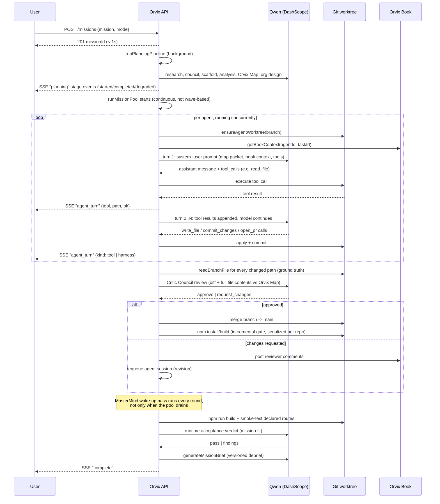

# Orvix Architecture

Orvix is one Node.js API plus one Ink/React CLI. There is no queue, no database, no
container orchestration between agents — a mission is an in-memory `MissionRun` object,
a directory of git worktrees on disk, and a stream of Server-Sent Events. This document
explains how those pieces fit together and why.


Diagram source: [`diagrams/architecture.mmd`](diagrams/architecture.mmd) (Mermaid — from
`docs/architecture`, re-render with `npx @mermaid-js/mermaid-cli -i diagrams/architecture.mmd -o diagrams/architecture.png -b white`).

A four-page PDF version — title/overview, this system diagram, the mission-lifecycle
sequence diagram, and a component breakdown — is at
[`diagrams/orvix-architecture.pdf`](diagrams/orvix-architecture.pdf), for submission
purposes.

This document covers the system shape and module map. For the mechanics of *how agents
actually coordinate*, see [`orvix-map/`](../orvix-map/) (the build contract),
[`orvix-book/`](../orvix-book/) (the shared ledger), [`planning/`](../planning/) (how the map
and org chart get produced), [`collaboration/`](../collaboration/) (negotiation and conflict
resolution), and [`owner-channel/`](../owner-channel/) (human-in-the-loop steering).

## The two runtimes

| Concern | Where it lives |
| --- | --- |
| Mission state, planning, scheduling, review, acceptance, the Orvix Book | `apps/api` — a single Node process, no external services |
| Cockpit UI, live rail, prompt bar, owner channel | `apps/cli` — an Ink/React terminal app that talks to the API over REST + SSE |
| Model calls | `packages/qwen` — Alibaba Cloud Model Studio (DashScope) OpenAI-compatible endpoint |
| Sandboxed git operations | `packages/workspace` — every mission gets its own repo under `.orvix/workspaces/<missionId>/`, one git worktree per agent branch |
| Shared types + on-disk snapshots | `packages/core` |

The CLI never talks to Qwen directly and never touches git. Every mutation goes through
the API, which is also what makes multiple CLI clients (or the CLI plus `curl`) safe to
point at the same running mission.

## Module map

```text
apps/api/src/
  envConfig.ts      env loading, project/workspace root resolution, envPositiveInt helper
  run.ts            MissionRun registry (in-memory Map), SSE broadcast/subscribe, run store I/O,
                    planning-stage recording, per-run metrics, reviewAttemptLimit
  book.ts           Orvix Book: post entries, filtered per-agent context, signal routing
  research.ts       research_web / fetch_url tool implementations used during planning
  planning.ts       createRun -> runPlanningPipeline -> bootstrapQwenReasoning:
                    research -> council -> scaffold -> mission analysis -> Orvix Map -> org
                    design (or solo baseline) -> review rubric
  agentRuntime.ts   executeAgentTask -> runAgentSession: the multi-turn tool-use loop, tool
                    execution against git worktrees, the no-implementation retry/block path,
                    harness auto-commit/auto-PR safety net
  review.ts         reviewPullRequest: deterministic gates + Qwen Critic Council review + merge,
                    supersede-empty-diff logic, owner-instruction routing + agent hiring
  acceptance.ts     runRuntimeAcceptanceGate (build + smoke test + Qwen judge),
                    runIncrementalBuildGate (post-merge-wave build check), repo command lock
  scheduler.ts      runMissionPool: the continuous work-pool scheduler (revisions, signals,
                    reviews, executions, build gate all running concurrently), the MasterMind
                    wake-up pass, runAutopilot
  brief.ts          generateMissionBrief: versioned MasterMind debrief on mission completion
  resume.ts         rebuild a MissionRun from its .orvix/runs/<id>/ snapshot after a restart
  server.ts         HTTP routes, SSE endpoint, bearer-token auth

apps/cli/src/
  App.tsx                        SSE client, mission lifecycle state, keybindings, owner @mention parsing
  index.tsx                      CLI entry, commander flags, onboarding/resume wiring
  components/SetupWizard.tsx     first-run onboarding: Demo / Local / Alibaba Cloud runtime cards
  components/LaunchPrompt.tsx    mission text entry + resume picker
  components/PlanningConsole.tsx live planning-stage rail, planner broadcast, org preview
  components/MissionCockpit.tsx  left rail (brand, mission, phase, live repo tree), focus/agents/
                                  activity panels, live agent-turn feed, brief tab, prompt bar

packages/core/src/
  types.ts          SimulationState, Agent, Task, PullRequest, OrvixBookEntry, AgentToolName, ...
  orchestrator.ts    applyOrganizationDesign, applyMissionAnalysis, appendTimelineEvent
  runStore.ts        on-disk run artifacts under .orvix/runs/<id>/

packages/qwen/src/
  client.ts   DashScope OpenAI-compatible client: chatDetailed (retry/backoff/concurrency
              semaphore/JSON mode/native tools), per-role models + fallback chains, model
              context-window metadata fetch, usage tracking, all planning/agent/review/
              acceptance/brief/owner-triage prompt builders + JSON parsers

packages/workspace/src/
  index.ts   sandboxed git workspace: scaffold creation, worktree management, path-escape
             guards, file read/write/delete, branch create/checkout/commit/diff/merge/sync,
             readBranchFile (full file content by branch, used to give reviewers ground truth)
```

## How a mission runs

1. **Planning** (background, streamed live over SSE): research → planning council → scaffold
   choice → MasterMind mission analysis → Orvix Map draft + review + lock → Strategy Weaver
   org design → Critic Council review rubric. `POST /missions` returns in well under a second;
   planning runs after the response and streams `planning` stage events
   (`started`/`completed`/`degraded`/`failed`) so nothing blocks and nothing hides a failure.

2. **Execution**: `runMissionPool` (`scheduler.ts`) is a continuous work-pool loop, not a
   fixed set of waves — revisions, signal answers, PR reviews, agent executions, and the
   post-merge build gate all run concurrently, refilling as jobs complete
   (`Promise.race`-driven). Each agent session (`agentRuntime.ts`) gets a system prompt built
   from its Orvix Map work packet, the Orvix Book context, and its allowed tools, then holds a
   real multi-turn conversation with Qwen — reading files, writing code, committing, and
   opening a PR against its own git worktree branch.

3. **Review**: Critic Council (`review.ts`) inspects each PR's diff *and* the full current
   content of every changed file on the branch — not the diff alone, since a file that is
   already correct on `main` shows a tiny or empty diff and would otherwise read as "missing."
   A deterministic gate rejects markdown-only or scaffold-incoherent PRs before Qwen even sees
   them. Reviewers may request changes but are instructed never to demand shell/build output
   from agents, who have no shell — that verification belongs to the build gate.

4. **Incremental build gate**: after each merge wave, Orvix runs `npm install` then
   `npm run build` against `main` and immediately routes any real break back to the merging
   agent. Install and build are serialized per repository directory so the incremental gate
   and the final acceptance gate never race each other's `node_modules`/`.next` output.

5. **Runtime acceptance**: once all required PRs are approved, Orvix builds the project for
   real, smoke-tests the routes the Orvix Map declared, and asks a Qwen judge whether the
   shipped product satisfies the mission's acceptance gates.

6. **MasterMind wake-up pass**: runs every scheduling round (not only when the pool drains).
   Any task stuck `blocked` — because reviewer feedback demanded something impossible, or an
   agent's session produced nothing — gets re-queued with an explicit Book message naming the
   blocker, up to `QWEN_BLOCKED_WAKE_LIMIT` times. This is what stops one agent's slow revision
   cycle from silently starving every other blocked agent forever.

7. **Orvix Book**: throughout, agents ask each other questions and publish
   contracts/assumptions/decisions in a shared ledger instead of coordinating through one
   shared context window. The Book is also where MasterMind posts wake-up calls, build-break
   notices, and owner-instruction delegations.

8. **Mission debrief**: on completion, `generateMissionBrief` produces a versioned
   `mission_brief` reasoning artifact (what was built, how, key files, how to test it, owner
   to-dos, next steps), announced in the Book and rendered in the CLI's `brief` tab. Re-running
   the mission via an owner request bumps the version.

9. **Owner channel**: a human can send instructions to a completed *or in-flight* mission
   (`POST /missions/:id/owner`, or `@mention` an agent from the CLI prompt bar — MasterMind is
   always CC'd). `masterMindOwnerTriage` uses Qwen to route the instruction: reopen a PR, post
   a Book contract to an existing agent, or — if no existing specialist fits — hire a new agent
   (`hireAgentForOwnerRequest`), which republishes `AGENTS.md` and adds it to the Agent Network
   automatically. The runtime acceptance gate is owner-aware: it re-runs after an owner change
   even on a mission that had already passed.

## Agent lifecycle sequence



## Design principles

- **No hidden deterministic fallback in qwen mode.** When a Qwen call fails, Orvix emits a
  `degraded` planning stage, leaves an Orvix Book question open, or fails the acceptance gate —
  it never synthesizes fake success or canned implementation code to paper over a failure.
  Mock mode is the only place with deterministic behavior, and it exists for offline demos, not
  to disguise Qwen failures.
- **Agents read before they write.** `runAgentSession` is a real multi-turn tool-use
  conversation; tool results (file contents, diffs, directory listings) are returned to the
  model, so agents can react to what they find instead of emitting one blind shot of code.
- **The harness commits the agent's own work, it doesn't write code for them.** If a session
  produces file changes but the agent forgets `commit_changes`/`open_pr`, Orvix commits and
  opens the PR on the agent's behalf — bookkeeping, not implementation synthesis.
- **Reviewers judge file contents, not diff shape.** A tiny or empty diff against `main` most
  often means the file is *already correct* there, not that work is missing — the reviewer gets
  the branch's real file contents so it never blames an agent for a git artifact.
- **A blocked agent is always the scheduler's problem, not the agent's.** The wake-up pass runs
  every round precisely so a slow neighbor can never starve a stuck workstream out of recovery.
- **Everything streams live.** Planning stages, agent tool calls, and metrics are all broadcast
  over SSE as they happen, not reconstructed after the fact from heuristics on event text.

## Where mission state lives on disk

```text
.orvix/
  workspaces/<missionId>/repo/     the mission's own git repo — a main branch plus one
                                    worktree per agent branch under the same repo's
                                    .git/worktrees/
  runs/<missionId>/
    state.json                     full SimulationState snapshot (agents, tasks, PRs, book)
    reasoningArtifacts (in state.json) — includes versioned mission_brief entries
    events.jsonl                   append-only event log
    book.jsonl                     append-only Orvix Book log
    signals.jsonl                  append-only agent signal log
    turns.jsonl                    append-only agent-turn log (for CLI resume)
    manifest.json                  run metadata
```

A restart never loses a mission: `resume.ts` rebuilds the in-memory `MissionRun` from this
snapshot, re-queues any task that was `active`/`blocked`/phantom-`In progress` when the process
stopped, and the CLI's `--resume <missionId>` flag replays the turn/event history before
reconnecting to the live SSE stream.
